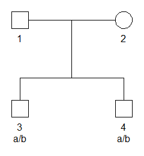

<!-- README.md is generated from README.Rmd. Please edit that file -->

## Introduction

The **symbolicpedprob** package implements symbolic evaluation of
pedigree likelihoods. So far, the likelihood can only be evaluated for a
single marker without the use of subpopulation correction or mutation
modelling.

The main function of the package is the `sLikelihood()` function. The
aim is to mimic the `likelihood()` function of the **pedprobr** package
which implements numeric evaluation of pedigree likelihoods.

## Getting started

``` r
library(symbolicpedprob)
library(pedtools)
```

To set up a simple example, we first use **pedtools** utilities to
create a pedigree where two brothers are genotyped with a single SNP
marker. The marker has alleles `a` and `b`, and both brothers are
heterozygous `a/b`.

``` r
# Pedigree with SNP marker
x = nuclearPed(nch = 2) |> 
  addMarker(geno = c(NA, NA, "a/b", "a/b"))

# Plot with genotypes
plot(x, marker = 1)
```



The pedigree likelihood, i.e., the probability of the genotypes given
the pedigree, is obtained as follows:

``` r
sLikelihood(x)
#> [1] "a^2*b^2+0.5*a^2*b+0.5*a*b^2+0.5*a*b"
```
